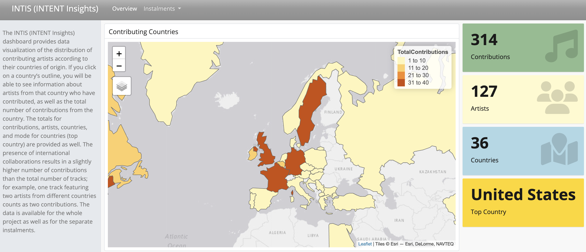

# INTIS (INTENT Insights)

The **INTIS** (INTENT Insights) dashboard provides data visualization of the distribution of contributing artists according to their countries of origin. If you click on a country’s outline, you will be able to see information about artists from that country who have contributed, as well as the total number of contributions from the country. The totals for contributions, artists, countries, and modes for artists and countries (top artist/country) are provided as well. The presence of international collaborations results in a slightly higher number of contributions than the total number of tracks; for example, one track featuring two artists from different countries counts as two contributions.

The data is available for the whole project as well as for the separate installments. INTIS also allows you to research the artists further; by clicking on the artist name in the Artist Discovery field, you will be able to see the results of a Google search on the artist name.

The dashboard can be downloaded [here](https://github.com/linfri/INTIS/blob/main/INTIS.html) as HTML file. Make sure to download the file via "Save Link As..."

